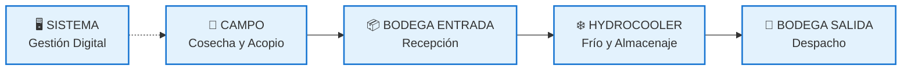
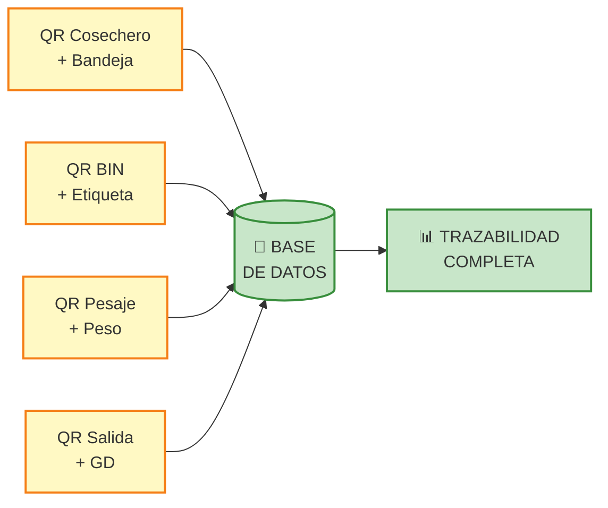
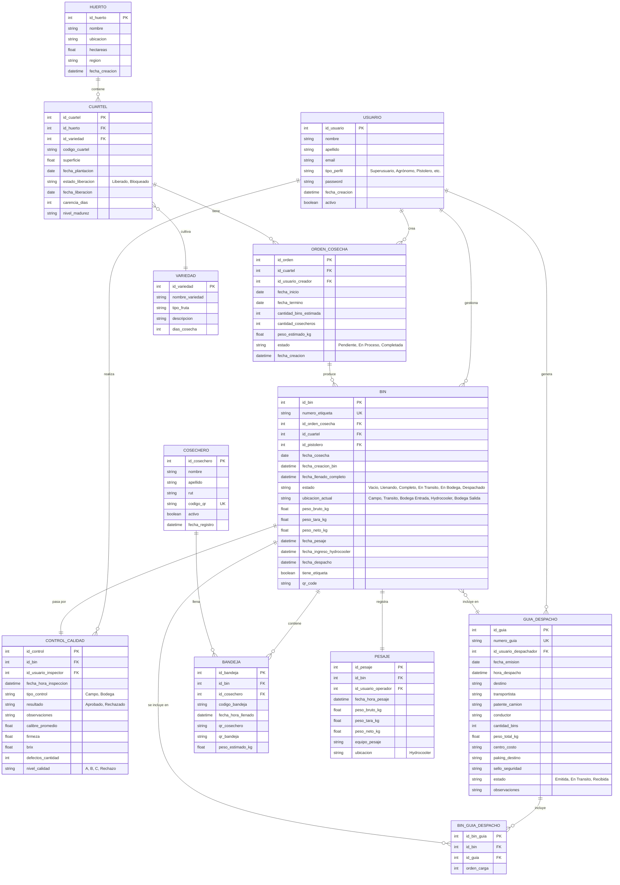
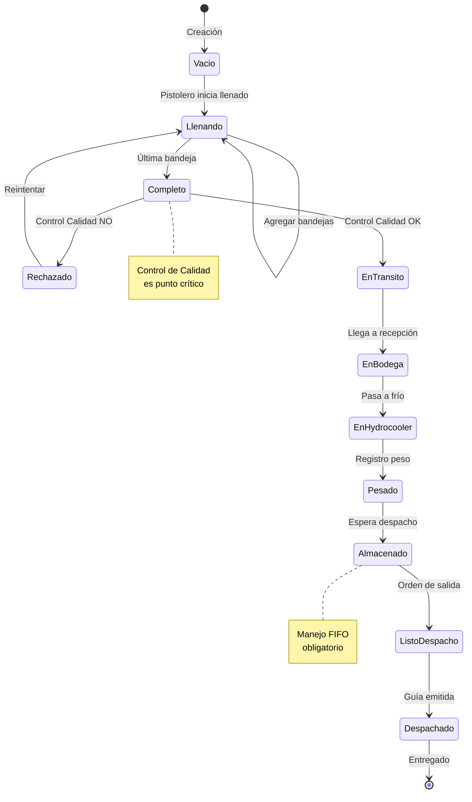

# Sistema de Gestión de Cosecha y BINS

## Diagrama de Flujo Completo del Sistema

```mermaid
flowchart LR
    Start(("INICIO"))
    
    %% ===== PROCESO 1: CREACIÓN DE PERFILES =====
    Start --> P1["<b>1. PERFILES</b><br/>📍 Sistema"]
    
    subgraph Perfiles ["👥 PERFILES"]
        direction TB
        P1_Super["Superusuario"]
        P1_Calidad["Control Calidad"]
        P1_Pistol["Pistolero"]
        P1_Cosech["Cosechero"]
        P1_Desp["Despachador"]
        P1_Visita["Visita"]
    end
    
    P1 --> Perfiles
    Perfiles --> P2
    
    %% ===== PROCESOS 2-4: PLANIFICACIÓN =====
    P2["<b>2. LIBERACIÓN<br/>CUARTEL</b><br/>👤 Agrónomo<br/>📍 Sistema"]
    P3["<b>3. ORDEN<br/>COSECHA</b><br/>👤 Agrónomo<br/>📍 Sistema"]
    P4["<b>4. CREACIÓN<br/>BIN</b><br/>👤 Enc. Acopio<br/>📍 Sistema"]
    
    P2 --> P3 --> P4 --> P5
    
    %% ===== PROCESO 5: LLENADO DE BINS =====
    P5["<b>5. LLENADO<br/>BINS</b><br/>👤 Pistolero<br/>📍 Campo"]
    P5c{"<b>CONTROL<br/>CALIDAD</b>"}
    
    P5 --> P5c
    P5c -->|"OK"| P6
    P5c -->|"NO"| P5
    
    %% ===== PROCESOS 6-7: TRASLADO Y RECEPCIÓN =====
    P6["<b>6. TRASLADO</b><br/>👤 Tractoristas<br/>📍 Campo"]
    P7["<b>7. RECEPCIÓN</b><br/>👤 Enc. Bodega<br/>📍 Bodega"]
    P7a{"¿Etiqueta?"}
    
    P6 --> P7 --> P7a
    P7a -->|"SÍ"| P8
    P7a -->|"NO"| P7b["Genera ID"]
    P7b --> P8
    
    %% ===== PROCESOS 8-12: HYDROCOOLER Y DESPACHO =====
    P8["<b>8. REDUCCIÓN<br/>TEMPERATURA</b><br/>👤 Hydrocooler<br/>📍 Hydrocooler"]
    P9["<b>9. PESAJE</b><br/>👤 Hydrocooler<br/>📍 Hydrocooler"]
    P10["<b>10. ALMACENAJE</b><br/>👤 Hydrocooler<br/>📍 Hydrocooler<br/>FIFO"]
    P11["<b>11. DESPACHO</b><br/>👤 Despacho<br/>📍 Bodega Salida"]
    P12["<b>12. GENERACIÓN<br/>GUÍA DESPACHO</b><br/>👤 Despacho<br/>📍 Sistema"]
    
    P8 --> P9 --> P10 --> P11 --> P12 --> End
    
    End(("FIN"))
    
    %% ===== ESTILOS =====
    classDef inicio fill:#4CAF50,stroke:#2E7D32,stroke-width:3px,color:#fff
    classDef proceso fill:#2196F3,stroke:#1565C0,stroke-width:2px,color:#fff
    classDef decision fill:#FF9800,stroke:#E65100,stroke-width:2px,color:#fff
    classDef resultado fill:#9C27B0,stroke:#6A1B9A,stroke-width:2px,color:#fff
    classDef perfil fill:#607D8B,stroke:#37474F,stroke-width:1px,color:#fff,font-size:11px
    
    class Start,End inicio
    class P1,P2,P3,P4,P5,P6,P7,P8,P9,P10,P11,P12 proceso
    class P5c,P7a decision
    class P7b resultado
    class P1_Super,P1_Calidad,P1_Pistol,P1_Cosech,P1_Desp,P1_Visita perfil
```

---

## 📋 Descripción de Actores

| Rol | Responsabilidad | Ubicación |
|-----|----------------|-----------|
| **Superusuario** | Modificación de datos del sistema | Sistema |
| **Control de Calidad** | Control de calidad en BIN virtual | Sistema/Campo |
| **Pistolero** | Crear y llenar BINS | Campo |
| **Cosechero** | Cosechar fruta | Campo |
| **Despachador** | Pesar y despachar fruta | Bodega |
| **Visita** | Ver proceso y reportes | Sistema |
| **Agrónomo** | Liberar cuarteles y crear órdenes | Sistema |
| **Enc. de Acopio** | Supervisar llenado y trazabilidad | Campo |
| **Tractoristas** | Transportar BINS campo → bodega | Campo |
| **Enc. Patio Bodega** | Recibir y verificar BINS | Bodega Entrada |
| **Personal Hydrocooler** | Temperatura, pesaje, almacenaje | Hydrocooler |
| **Personal Despacho** | Salida y guías de despacho | Bodega Salida |

---

## 📍 Ubicaciones del Sistema

---

## ⚠️ Puntos Críticos de Control

### 🔴 Control de Calidad (Proceso 5)
- **Decisión**: Aprobación o rechazo de BINS
- **Criterios**: Parámetros de calidad ingresados
- **Impacto**: BIN rechazado debe ser rellenado

### 🔴 Verificación de Etiquetas (Proceso 7)
- **Validación**: Presencia y correcta información en etiquetas
- **Sin etiqueta**: Se genera ID desde sistema
- **Trazabilidad**: Crítico para seguimiento

### 🔴 Manejo FIFO (Proceso 10)
- **Principio**: First In, First Out
- **Control**: Inventario y rotación de BINS
- **Objetivo**: Evitar pérdida de calidad por tiempo

### 🔴 Guía de Despacho (Proceso 12)
- **Legal**: Documento tributario obligatorio
- **Información**: BINS, sello seguridad, destino
- **Copias**: 2 ejemplares para trazabilidad

---

## 🔄 Flujo de Datos Clave

---

## 🗄️ Modelo de Datos del Sistema

### Diagrama Entidad-Relación

### 📊 Descripción de Entidades Principales

#### 🔹 USUARIO
Representa todos los actores del sistema con diferentes perfiles de acceso (Superusuario, Agrónomo, Pistolero, Control de Calidad, Despachador, etc.).

#### 🔹 HUERTO y CUARTEL
Estructura la ubicación física de la cosecha. Un huerto contiene múltiples cuarteles, cada uno con una variedad específica de fruta.

#### 🔹 ORDEN_COSECHA
Plan de cosecha creado por el agrónomo que especifica qué cuartel se cosechará, fechas, y recursos necesarios.

#### 🔹 BIN
Entidad central del sistema. Contenedor que almacena la fruta cosechada y cuyo ciclo de vida se rastrea desde el campo hasta el despacho.

#### 🔹 BANDEJA
Unidades individuales de recolección asociadas a un cosechero específico, que se agrupan en un BIN.

#### 🔹 COSECHERO
Trabajadores que realizan la cosecha y llenan las bandejas. Cada uno tiene un código QR único.

#### 🔹 CONTROL_CALIDAD
Registros de inspecciones de calidad realizadas a los BINS en diferentes etapas (campo y bodega).

#### 🔹 PESAJE
Registro del peso de los BINS en el hydrocooler, calculando peso bruto, tara y neto.

#### 🔹 GUIA_DESPACHO
Documento legal de salida que agrupa múltiples BINS para su transporte al destino final.

### 🔑 Relaciones Clave

- Un **CUARTEL** puede tener múltiples **ÓRDENES DE COSECHA**
- Una **ORDEN** produce múltiples **BINS**
- Un **BIN** contiene múltiples **BANDEJAS**
- Cada **BANDEJA** es llenada por un **COSECHERO**
- Cada **BIN** pasa por un **CONTROL DE CALIDAD**
- Cada **BIN** tiene un registro de **PESAJE**
- Una **GUÍA DE DESPACHO** incluye múltiples **BINS**

### 📈 Flujo de Estados del BIN

